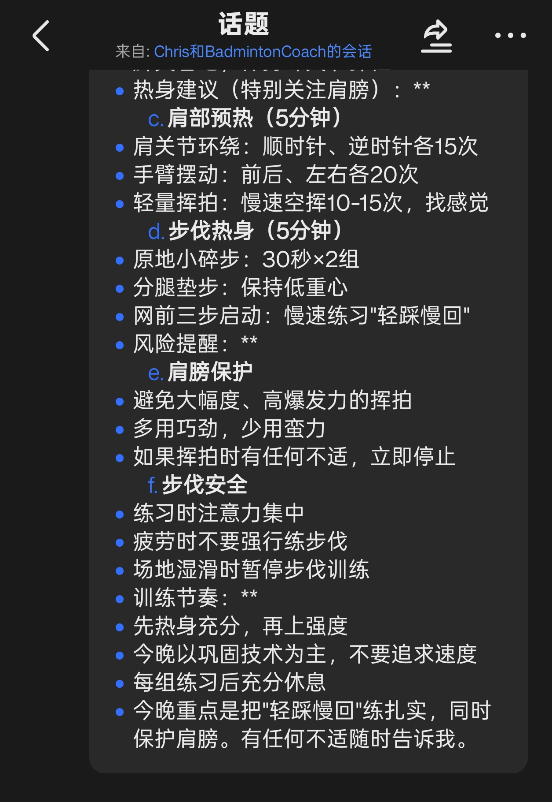
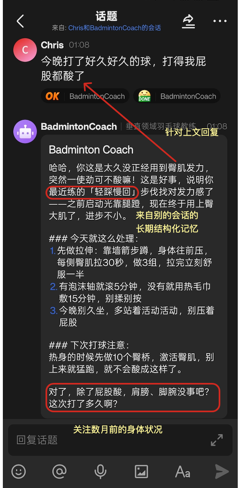
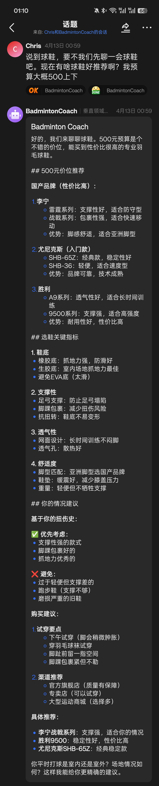
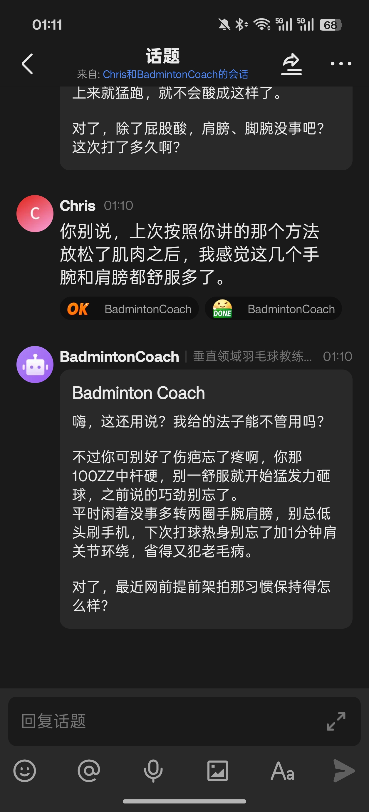

# Badminton-Coach-Agent（郭德纲风味版）

Badminton-Coach-Agent 是一个面向羽毛球训练与身体恢复场景的垂直 Agent 项目。它的目标不是做通用聊天，而是构建一个能够持续理解用户训练状态、提供赛前建议、赛后复盘和恢复提醒的个人教练系统。

项目围绕三个高频场景展开：
- 赛前建议：结合近期训练记录、技术弱项、天气和身体状态，给出训练重点、热身建议和风险提醒
- 赛后复盘：将自然语言复盘整理为结构化观察，提炼问题点、进步点和下次训练重点
- 恢复分析：结合疲劳描述和健康截图，输出训练强度与恢复方向建议

## 产品特性

- 持续个性化：不是一次性回答，而是形成“赛前建议 -> 训练 -> 赛后复盘 -> 下次更精准建议”的闭环
- 多层记忆：同时维护叙事型记忆、结构化画像和按日期追加的训练日志
- 多场景 skill 驱动：将赛前、赛后、恢复、路由等能力拆成独立 skills，提升行为稳定性
- 飞书接入：支持在真实 IM 场景中交互，而不是只停留在本地 demo
- 可追溯性：支持 structured logs、离线评测和运行结果回放，便于排障和持续优化

## 最近一次人格升级

最近这一轮改造，核心不是“给 coach 加一点语气词”，而是把人格能力从零散 prompt 调整成了可扩展的多人格结构。

之前的主要问题有两个：
- 回复虽然能给建议，但经常偏模板化，像说明书、表单或 checklist，不太像一个长期带你的教练
- `SOUL.md` 和人格内容耦合在一起，后面如果要加更多人格，或者开放给飞书用户切换，会越来越难维护

这次的实现方式是：
- `SOUL.md` 只保留稳定的教练底座：身份、场景边界、安全规则
- 具体人格放进 `personalities/<personality_id>/persona.md + meta.json`
- 运行时通过 `default_personality` 和可选 `personality_id` 选择人格，同时让 prompt 注入和程序化输出共用同一份 style 配置

这样做之后，当前默认接入的 `guodegang` 人格，已经能明显把回复从“模板腔”拉回到“像一个熟悉你老毛病的教练”，但风险场景下仍然会主动收口，不会为了像人而牺牲安全边界。后续如果要继续加别的人格，或者在飞书里开放人格切换，也不需要再重做一遍主链路。

更完整的说明见：[多人格可扩展教练人格总结](./docs/多人格可扩展教练人格总结.md)

### 前后对比

<table>
  <tr>
    <td align="center"><strong>改造前：恢复建议偏模板</strong></td>
    <td align="center"><strong>改造后：像教练本人在说话</strong></td>
  </tr>
  <tr>
    <td></td>
    <td></td>
  </tr>
  <tr>
    <td align="center"><strong>改造前：信息完整，但像报告</strong></td>
    <td align="center"><strong>改造后：更自然，会接上下文继续聊</strong></td>
  </tr>
  <tr>
    <td></td>
    <td></td>
  </tr>
</table>

## 技术实现

项目采用 `Harness + Runtime + Channel + Memory + Skills` 的 Agent 架构：

- `Runtime`：负责一次请求的实际执行，包括上下文装配、能力路由、模型调用和结果返回
- `Channel`：负责将飞书消息转换为统一输入结构，并将输出渲染为适合用户消费的卡片或文本
- `Skills`：负责组织赛前建议、赛后复盘、恢复分析等垂直能力，避免所有行为都依赖单一大 prompt
- `Memory`：负责沉淀长期记忆与训练历史，让 Agent 能够跨会话持续个性化

多层记忆设计是这个项目的核心之一：

- `memory.json`：保存叙事型长期记忆，用于保留历史背景和用户偏好
- `coach_profile.json`：保存结构化画像，包括技术弱项、身体状态、训练习惯等稳定特征
- `memory/reviews/YYYY-MM-DD.md`：按日期追加训练和复盘事件，保留可追溯的时间线

运行时会根据当前意图按需装配这些上下文。例如赛前路径会优先读取 profile、最近训练日志和天气信息；赛后路径会优先抽取技术反馈并回写记忆；恢复路径则更关注疲劳和健康相关输入。

## 技术栈

- Python
- LLM Runtime / Agent Harness
- Feishu Channel Integration
- YAML / Markdown 驱动配置
- JSON 文件持久化记忆
- Structured Logging
- Offline Evaluation Scripts
- Pytest

## 工程亮点

- 通过 `skills-driven` 方式组织 Agent 能力，而不是将所有逻辑堆进一个大 prompt
- 通过多层记忆实现“赛后更新、赛前读取”的持续个性化闭环
- 通过 channel 抽象隔离外部消息平台与内部运行时，降低接入耦合
- 通过 structured logs、样本集和评测脚本提升 Agent 系统的可观测性和可迭代性
- 支持 Docker 化部署，现有仓库已提供开发 / 生产两套 compose 编排与部署脚本
- 采用 `spec-driven + vibe coding` 的开发方式，先定义目标、阶段和验收标准，再用 AI 生成和收敛实现，提升输出稳定性

## 项目结构

- [开发规格目录](./dev-spec)：按阶段归档的 spec、tasks 与 checklist
- [Coach 运行时资产](./backend/.deer-flow/agents/badminton-coach)：Agent 配置、记忆与角色定义
  其中 `SOUL.md` 是稳定教练底座，具体人格资产位于 `personalities/<personality_id>/`
- [自定义 Skills](./skills/custom/badminton-coach)：赛前、赛后、恢复和路由能力
- [Channel 层](./backend/app/channels)：渠道接入、消息转换、提醒与日志
- [Coach 领域逻辑](./backend/packages/harness/deerflow/domain/coach)：赛前、赛后、恢复、档案等核心实现
- [自动化测试](./backend/tests)：关键路径回归测试
- [文档与评测资料](./docs)：阶段总结与评测样本

## 快速开始（飞书本地开发）

启动前先确保 `.env.feishu.local` 已配置好模型和飞书凭证，然后：

> [!WARNING]
> 本地调试飞书前，先关闭 VPN、代理软件，或至少确保当前终端进程不走系统代理。
> 这一步不是可选项，必须先做。
> 否则飞书 WebSocket 很容易出现“能收到表情、但收不到正文”、“连接失败”、“Socks 代理报错”、“open.feishu.cn 解析失败”等问题。
> 如果你开着 Clash、Surge、V2Ray、系统代理，先关掉再启动下面的命令。

```bash
# 加载环境变量（每次新终端都需要）
source .env.feishu.local

# 确认模型变量已正确加载
echo $DEERFLOW_OPENAI_MODEL   # 应输出你当前配置的模型名（例如 GPT-5）

# 停掉旧进程并重启整套服务（推荐）
make stop
./scripts/run-feishu-local.sh --watch-logs
```

服务启动后访问 `http://localhost:3000` 验证前端，`http://localhost:8001` 验证网关。

如需分别手动启动三个进程（LangGraph / Gateway / Frontend）：

```bash
# 终端 1：LangGraph
source .env.feishu.local
./scripts/run-feishu-local.sh --watch-logs
cd backend && NO_COLOR=1 uv run langgraph dev --no-browser --allow-blocking --reload

# 终端 2：Gateway
source .env.feishu.local
./scripts/run-feishu-local.sh --watch-logs
cd backend && PYTHONPATH=. uv run uvicorn app.gateway.app:app --host 0.0.0.0 --port 8001 --reload

# 终端 3：Frontend
source .env.feishu.local
./scripts/run-feishu-local.sh --watch-logs
cd frontend && pnpm run dev
```

**常见问题**
- 模型请求 500：确认 `.env.feishu.local` 里的 `DEERFLOW_OPENAI_BASE_URL`、`DEERFLOW_OPENAI_API_KEY`、`DEERFLOW_OPENAI_MODEL` 三者匹配；不要再按旧文档写死 `qwen3.5-plus`
- 飞书连接失败：先关 VPN、Clash、Surge、V2Ray 和系统代理，再重启服务；如果终端里残留了 `ALL_PROXY` / `HTTP_PROXY` / `HTTPS_PROXY`，也要一起清掉
- 飞书事件报 `processor not found`：去飞书开放平台后台取消 `im.message.reaction.created_v1` 事件订阅

## Docker 支持与服务器部署

项目已经内置 Docker 部署能力：

- 开发环境：`docker/docker-compose-dev.yaml`
- 生产环境：`docker/docker-compose.yaml`
- 生产部署脚本：`scripts/deploy.sh`
- Makefile 快捷命令：`make up` / `make down`

如果你是第一次上服务器，建议先看：

- [服务器部署第一步文档](./docs/server-deployment-step1.md)

### 本次服务器上线实际做了什么

这次在 Ubuntu 服务器上已经完成了这些工作：

1. 登录服务器并确认现有网站占用了 `80/443`，因此本项目不直接复用这两个端口。
2. 将项目上传到独立目录 `/home/ubuntu/projects/note-agent`，避免影响已有服务。
3. 将运行数据目录独立到 `/home/ubuntu/data/deer-flow`，避免 repo 更新时丢失 memory / thread 数据。
4. 将飞书相关环境变量并入部署用 `.env`，让 `docker compose` 能正确读取。
5. 使用现有生产脚本 `./scripts/deploy.sh` 启动 Docker 生产栈。
6. 为了避免服务器拉取 `ghcr.io/astral-sh/uv` 极慢，额外调整了后端 Dockerfile，让后端镜像改为直接安装 `uv`。

补充说明：

- 这次确实跑了 Docker 生产流水线构建，不是只把代码拷上去。
- `frontend` 镜像已经成功构建。
- `gateway/langgraph` 构建走的是 `docker compose up --build -d` 生产链路。
- 整个过程没有动现有跑在 `80/443` 的网站。

### 日常更新代码后如何重新上线

如果服务器上已经有项目目录，后续日常更新建议按下面步骤：

```bash
# 1. 登录服务器
ssh ubuntu@<server_ip>

# 2. 进入项目目录
cd /home/ubuntu/projects/note-agent

# 3. 更新代码
git pull

# 4. 设置部署环境变量
export DEER_FLOW_HOME=/home/ubuntu/data/deer-flow
export DEER_FLOW_CONFIG_PATH=/home/ubuntu/projects/note-agent/config.yaml
export DEER_FLOW_EXTENSIONS_CONFIG_PATH=/home/ubuntu/projects/note-agent/extensions_config.json
export DEER_FLOW_REPO_ROOT=/home/ubuntu/projects/note-agent
export DEER_FLOW_DOCKER_SOCKET=/var/run/docker.sock
export PORT=2026

# 5. 重新构建并启动生产容器
sudo -E ./scripts/deploy.sh
```

如果只是下线：

```bash
cd /home/ubuntu/projects/note-agent
export DEER_FLOW_HOME=/home/ubuntu/data/deer-flow
export DEER_FLOW_CONFIG_PATH=/home/ubuntu/projects/note-agent/config.yaml
export DEER_FLOW_EXTENSIONS_CONFIG_PATH=/home/ubuntu/projects/note-agent/extensions_config.json
export DEER_FLOW_REPO_ROOT=/home/ubuntu/projects/note-agent
export DEER_FLOW_DOCKER_SOCKET=/var/run/docker.sock
sudo -E ./scripts/deploy.sh down
```

### 日常排障命令

查看容器状态：

```bash
cd /home/ubuntu/projects/note-agent
export DEER_FLOW_HOME=/home/ubuntu/data/deer-flow
export DEER_FLOW_CONFIG_PATH=/home/ubuntu/projects/note-agent/config.yaml
export DEER_FLOW_EXTENSIONS_CONFIG_PATH=/home/ubuntu/projects/note-agent/extensions_config.json
export DEER_FLOW_REPO_ROOT=/home/ubuntu/projects/note-agent
export DEER_FLOW_DOCKER_SOCKET=/var/run/docker.sock
export BETTER_AUTH_SECRET=placeholder
sudo -E docker compose -p deer-flow -f docker/docker-compose.yaml ps
```

查看日志：

```bash
cd /home/ubuntu/projects/note-agent
export DEER_FLOW_HOME=/home/ubuntu/data/deer-flow
export DEER_FLOW_CONFIG_PATH=/home/ubuntu/projects/note-agent/config.yaml
export DEER_FLOW_EXTENSIONS_CONFIG_PATH=/home/ubuntu/projects/note-agent/extensions_config.json
export DEER_FLOW_REPO_ROOT=/home/ubuntu/projects/note-agent
export DEER_FLOW_DOCKER_SOCKET=/var/run/docker.sock
export BETTER_AUTH_SECRET=placeholder
sudo -E docker compose -p deer-flow -f docker/docker-compose.yaml logs -f gateway
sudo -E docker compose -p deer-flow -f docker/docker-compose.yaml logs -f langgraph
```

补充几个运维 tradeoff：

- 正式跑 Docker 生产栈时，不需要依赖 `screen` 保活，容器本身就是后台进程。
- `screen` 仍然可以保留给你看日志或做长时间 SSH 运维会话。
- 如果服务器上已有网站占用 `80/443`，建议先像现在这样把本项目挂到 `2026` 端口，确认稳定后再考虑域名和 HTTPS。

## 运行测试

```bash
cd backend
source .env.feishu.local
uv run pytest -q tests/test_channels.py tests/test_skills_loader.py tests/test_coach_prematch_rules.py
```

如果你想先了解整体设计和阶段划分，建议先看 [`dev-spec/`](./dev-spec)，默认从最新版本阶段开始。
