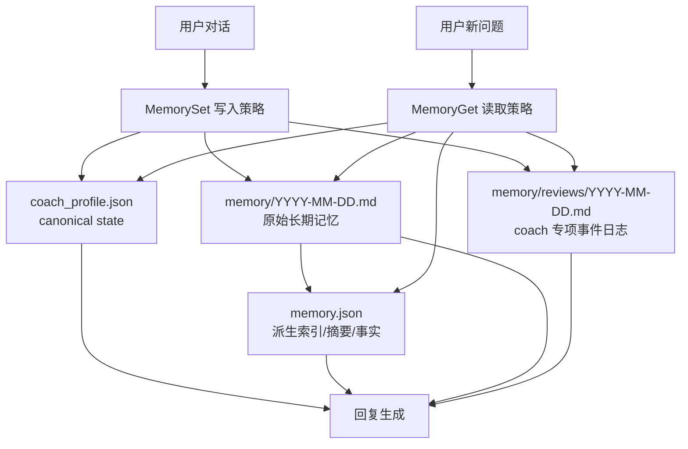
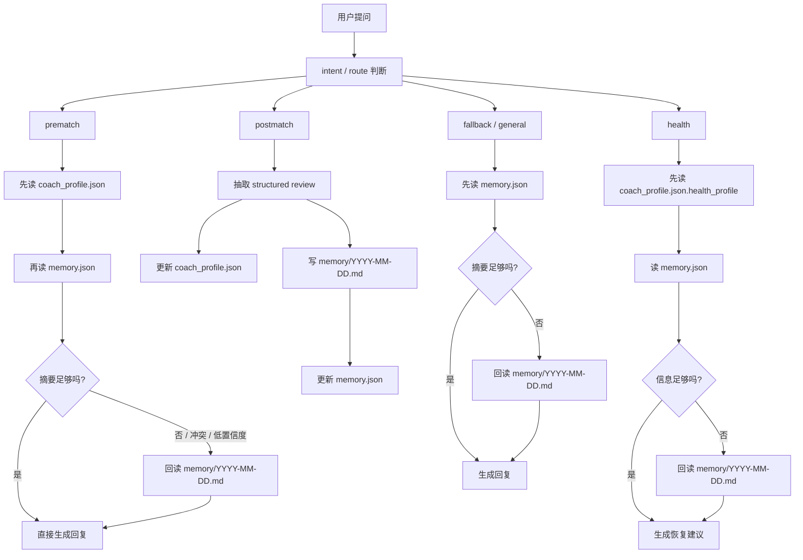

# Developer Specification (DEV_SPEC)

> 版本：2.2 — File-First Memory Traceability

## 目录

- 项目概述
- 核心术语
- Memory 架构
- 读取与写入调用链
- 设计取舍（Tradeoffs）
- 实施任务与 Checklist

***

## 1. 项目概述

### 1.1 项目定位

本规格聚焦当前项目的 memory 能力补全，目标不是重做整套记忆系统，而是在现有 `memory.json` 与 coach domain memory 基础上，补上一层简单、稳定、可追溯的原始记忆沉淀层，并让提炼后的 memory 能回指真实对话。

本阶段重点解决的问题是：

- 长期记忆只有提炼结果，缺少原始沉淀层
- `memory.json` 中的 summary / facts 不能稳定回指真实 thread
- 什么时候只读摘要，什么时候需要回到原始上下文，当前没有明确策略
- coach domain memory 与 general memory 的职责边界还不够清晰

本阶段不引入数据库，不做向量存储，不追求复杂检索，只优先实现：

- 文件优先
- 可人工审阅
- 可回溯到 thread
- 索引可重建
- 读写路径可控

### 1.2 为什么采用文件优先，而不是数据库

本项目的 memory 设计参考 OpenClaw / Claude Code 一类“本地文件优先”的个人助理思路。

采用 Markdown / JSON 文件而不是数据库，原因如下：

#### 1.2.1 schema free 与模型友好

- Markdown 与 JSON 都是轻量、schema free 的存储方式，不需要先设计复杂库表
- Markdown 对模型天然友好，读取时不需要经过 text-to-sql 或额外转换
- 对当前项目来说，文件读取与搜索比 SQL 查询更简单、更稳定、更容易调试

#### 1.2.2 对非技术用户更友好

- 用户可以直接打开文件夹查看记忆
- 记忆内容可手动搜索、审阅、备份与迁移
- 比起数据库导出导入，复制整个 memory 目录的理解成本更低

#### 1.2.3 零运维与高可移植性

- 不需要部署数据库服务
- 不引入额外云成本和供应商锁定
- 未来更换模型时，只要读取同一份文件目录即可继承记忆

本阶段的取舍是：优先可解释性、可维护性与可迁移性，而不是优先复杂查询能力。

### 1.3 项目目标

本阶段有三层目标。

**产品目标**

- 让长期记忆既能被模型读取，也能被人直接查看
- 让提炼后的 memory 能回指到真实 thread
- 让 coach domain memory 与 general memory 边界清楚

**工程目标**

- 新增 Markdown 记忆沉淀层
- 让 `memory.json` 成为派生索引，而不是唯一记忆来源
- 为 summary / facts 增加来源引用
- 明确何时需要回读 Markdown 原文
- 保持 `coach_profile.json` 的 canonical state 职责不变

**设计目标**

- 维持 file-first
- 保持结构简单
- 索引可重建
- 真实写入链路受代码控制，而不是依赖模型偶然行为

### 1.4 本期范围

#### 1.4.1 本期必须完成

- 定义新的 memory 文件分层
- 新增 `memory/YYYY-MM-DD.md` 作为原始长期记忆沉淀层
- 扩展 `memory.json` 的来源字段设计
- 明确 `memory.json` 与 Markdown 之间的关系
- 定义 memory 读取策略和下钻条件
- 定义统一的 `MemoryGet` / `MemorySet` 抽象
- 保持 `coach_profile.json` 职责不变
- 补齐后端与前端所需最小任务清单与验收项

#### 1.4.2 本期不纳入

- 数据库
- 向量检索
- message-level span 精确定位
- `coach_profile.json` 改为 Markdown canonical state
- 复杂自动归档策略和大规模历史迁移

### 1.5 成功标准

- 长期记忆新增原始 Markdown 存储层
- `memory.json` 中的 summary / facts 能引用至少一个 memory entry
- `memory.json` 在理论上可由 Markdown 重建
- 调用链中明确“是否下钻原文”的条件
- 前端 memory 展示层具备“查看来源 thread”的最小能力设计
- `coach_profile.json` 继续只由代码 merge 更新

***

## 2. 核心术语

### 2.1 canonical state

`canonical state` 指“某个领域里唯一受信任、可作为最终当前状态依据的数据表示”。

在本项目里：

- `coach_profile.json` 是 coach 领域的 canonical state
- `memory.json` 不是 canonical state，它是派生索引
- `memory/YYYY-MM-DD.md` 是原始证据层，但不是“当前状态快照”

为什么 `coach_profile.json` 是 canonical state：

- 它保存稳定结构化状态
- 它适合规则读取和代码 merge
- 它不允许 LLM 直接自由改写

简单理解：

- 原始事实看 Markdown
- 当前稳定训练状态看 `coach_profile.json`
- 快速长期摘要看 `memory.json`

### 2.2 source of truth

`source of truth` 指原始可信来源。

在 general memory 体系里：

- `memory/YYYY-MM-DD.md` 是原始长期记忆的 source of truth
- `memory.json` 是从它提炼出来的索引

### 2.3 MemoryGet

`MemoryGet` 是一个逻辑抽象，不一定要先做成独立类，但 spec 里需要先定义职责。

职责：

- 根据当前请求类型，决定读哪些 memory 层
- 先返回低成本摘要
- 必要时再下钻到 Markdown 原文

### 2.4 MemorySet

`MemorySet` 也是一个逻辑抽象。

职责：

- 控制长期记忆的写入顺序
- 先写原始 entry，再更新派生索引
- 保证 `memory.json` 中的来源引用真实存在

### 2.5 memory entry

`memory entry` 指 `memory/YYYY-MM-DD.md` 中的一条原始沉淀记录。

一条 entry 至少包含：

- `entry_id`
- `thread_id`
- `ts`
- 用户输入摘要
- assistant 输出摘要
- 抽取信号

***

## 3. Memory 架构

### 3.1 文件布局

建议采用如下结构：

```text
backend/.deer-flow/agents/badminton-coach/
├── memory.json
├── coach_profile.json
└── memory/
    ├── 2026-04-07.md
    ├── 2026-04-08.md
    └── ...
```

说明：

- 当前项目已经切到 `badminton-coach` 的独立入口，因此本规格只讨论 `backend/.deer-flow/agents/badminton-coach/` 下的 memory
- `memory.json`、`coach_profile.json` 与 `memory/YYYY-MM-DD.md` 都放在同一个 agent 目录下
- coach agent 继续保留 `coach_profile.json`
- `memory/` 直接存长期记忆沉淀的会话内容

### 3.2 分层职责

#### 3.2.1 `memory/YYYY-MM-DD.md`

职责：

- 按日期沉淀值得长期保留的真实对话摘要
- 记录 entry 级别的 `thread_id`
- 为 `memory.json` 提供可追溯来源

特点：

- 人可直接阅读
- 模型可直接读取
- 内容允许冗余，但要结构清晰

#### 3.2.2 `memory.json`

职责：

- 保存适合 prompt 注入的长期 summary、facts、preferences
- 保存这些提炼内容对应的来源 entry id 和 thread id
- 作为轻量检索索引服务推理流程

特点：

- 不是原始证据
- 可以重建
- 内容要短、稳、适合注入

#### 3.2.3 `coach_profile.json`

职责：

- 保存教练域的稳定结构化状态
- 作为 canonical state
- 只接受代码 merge，不接受 LLM 直接自由改写

职责不变，本次不调整其基本定位。

#### 3.2.4 `memory/reviews/YYYY-MM-DD.md`

职责：

- 保存 coach 场景下每次 postmatch 的专项事件证据
- 强调训练事实与时间线
- 为 `coach_profile.json` 的聚合结果提供解释依据

### 3.3 Memory 架构图



### 3.4 读取优先级

一般读取建议：

1. `coach_profile.json`
2. `memory.json`
3. 命中的 `memory/YYYY-MM-DD.md`

原因：

- 先读结构化状态，成本最低
- 再读提炼索引，适合快速 grounding
- 最后按需打开原始 Markdown，补来源与细节

***

## 4. 读取与写入调用链

### 4.1 Markdown entry 格式

`memory/YYYY-MM-DD.md` 采用按 entry 追加的形式，每条 entry 至少包含：

- `entry_id`
- `ts`
- `thread_id`
- `agent_name`
- `kind`
- `tags`
- `importance`
- `User`
- `Assistant`
- `Signals`

推荐格式：

```md
## entry:e20260407-01

- ts: 2026-04-07T10:32:11+08:00
- thread_id: thread_xxx
- agent_name: badminton-coach
- kind: prematch
- tags: badminton, prematch
- importance: medium

### User
今晚打双打，重点想练后场和反手。

### Assistant
给出赛前热身、风险提醒、训练重点。

### Signals
- 近期目标：加强后场步法
- 偏好：双打场景
```

约束：

- 同一 entry 只对应一次长期记忆沉淀动作
- `entry_id` 在当前 memory 目录内唯一
- `thread_id` 必填
- 内容应可支持人工快速回顾

### 4.2 `memory.json` 结构扩展

在现有结构基础上增加来源信息。

#### 4.2.1 summary section

当前：

```json
{
  "summary": "...",
  "updatedAt": "..."
}
```

调整后：

```json
{
  "summary": "...",
  "updatedAt": "...",
  "sources": ["e20260407-01", "e20260406-03"],
  "thread_ids": ["thread_xxx", "thread_yyy"]
}
```

适用范围：

- `user.workContext`
- `user.personalContext`
- `user.topOfMind`
- `history.recentMonths`
- `history.earlierContext`
- `history.longTermBackground`

#### 4.2.2 facts

当前：

```json
{
  "id": "fact_x",
  "content": "...",
  "category": "goal",
  "confidence": 0.92,
  "createdAt": "...",
  "source": "thread_xxx"
}
```

调整后：

```json
{
  "id": "fact_x",
  "content": "...",
  "category": "goal",
  "confidence": 0.92,
  "createdAt": "...",
  "sources": ["e20260407-01"],
  "thread_ids": ["thread_xxx"]
}
```

设计说明：

- 不再只保留单个 `source`
- 改为显式记录 entry id 与 thread id
- 允许一个 fact 合并多个来源

### 4.3 MemorySet：写入策略

MemorySet 的写入顺序必须是：

1. 判断本轮对话是否值得进入长期记忆
2. 如果值得，先写 `memory/YYYY-MM-DD.md`
3. 生成或取得 `entry_id`
4. 再更新 `memory.json`
5. 如属于 coach 结构化状态更新，再更新 `coach_profile.json`

核心约束：

- 不允许“先写 `memory.json`，后补 Markdown”
- 不允许 summary / fact 没有来源 entry
- `coach_profile.json` 的写入继续遵守现有代码 merge 规则

### 4.4 MemoryGet：读取策略

MemoryGet 的默认流程是：

1. 根据请求类型判断 route
2. 先读低成本层：`coach_profile.json` + `memory.json`
3. 判断当前信息是否足够
4. 如果不足或冲突，再根据 `sources` 下钻到 `memory/YYYY-MM-DD.md`

### 4.5 什么时候要索引 `memory/YYYY-MM-DD.md`

这里“索引原文”指从 `memory.json` 的来源字段出发，回读对应 Markdown entry。

必须下钻原文的情况：

1. `memory.json` 的 summary 不足以支持当前回答  
   例如摘要太短，只知道“用户最近在练后场”，但不知道是在单打还是双打语境下提出的。

2. 多层信息冲突  
   例如：
   - `coach_profile.json` 显示弱项是后场步法
   - `memory.json` 的 topOfMind 强调最近在练网前
   - 这时需要回原始 entry 判断时间与上下文

3. 事实置信度不高  
   例如 fact 的 `confidence` 低于设定阈值，不能直接作为高确信 grounding。

4. 用户显式要求追溯来源  
   例如“你为什么这么判断”“这是基于哪次对话”“给我看之前那次记录”。

5. 需要解释或审计  
   比如前端 memory 页面要展示来源、或者开发者在 debug memory 是否写错。

6. 同一事实合并了多个来源，且需要消解冲突  
   例如过去偏好与最近偏好不一致，需要回原文判断是否已经发生变化。

默认不下钻原文的情况：

- 当前 `coach_profile.json` 与 `memory.json` 已经足够
- 用户问题是高频、短路径问题，需要低延迟返回
- 没有冲突，也没有解释需求

### 4.6 Route 级调用图



### 4.7 对应到当前代码的建议读取顺序

#### 4.7.1 prematch

读取顺序：

1. 当前消息
2. `coach_profile.json`
3. `memory.json`
4. 若不足或冲突，再读 `memory/YYYY-MM-DD.md`
5. 若需要最近专项训练事实，再读 `memory/reviews/YYYY-MM-DD.md`

原因：

- prematch 的第一优先级是当前稳定状态
- 长期摘要用于补背景
- 原始原文只在需要 disambiguation 时打开

#### 4.7.2 postmatch

读取顺序：

1. 当前消息
2. 必要时读现有 `coach_profile.json` 做 merge
3. 写 `memory/YYYY-MM-DD.md`
4. 写 `memory.json`
5. 写 `coach_profile.json`
6. 写 `memory/reviews/YYYY-MM-DD.md`

说明：

- postmatch 的重点不是“读多少”，而是“怎么拆信息并回写”

#### 4.7.3 health

读取顺序：

1. 当前消息 / 当前截图解析
2. `coach_profile.json.health_profile`
3. `memory.json`
4. 若恢复历史或上下文不足，再读 `memory/YYYY-MM-DD.md`

#### 4.7.4 general / fallback

读取顺序：

1. `memory.json`
2. 若摘要不足或用户要求来源，读 `memory/YYYY-MM-DD.md`
3. 通常不直接读 `coach_profile.json`，除非 route 已明确在 coach 领域内

### 4.8 `memory.json` 与 Markdown 的关系

`memory.json` 是索引，不是原始记忆。

应满足以下不变量：

- 每个 summary 的 `sources` 至少指向一个存在的 Markdown entry
- 每个 fact 的 `sources` 至少指向一个存在的 Markdown entry
- 任一 `sources` 中的 entry 均能找到对应 `thread_id`
- 当 `memory.json` 丢失时，可以通过 Markdown 重新提炼生成

### 4.9 coach memory 的关系

coach 场景下的四个文件职责如下：

- `memory/YYYY-MM-DD.md`
  - 通用长期记忆沉淀
  - 面向跨话题、跨 session 的长期背景与可追溯性
- `memory.json`
  - 面向 prompt 注入的提炼索引
  - 适合快速读取，不适合承载全部上下文
- `memory/reviews/YYYY-MM-DD.md`
  - 面向 coach postmatch 的专项事件证据日志
  - 强调训练/比赛事实沉淀
- `coach_profile.json`
  - 面向弱项、疲劳、偏好等稳定结构化状态

四者可以互相引用，但不互相替代。

***

## 5. 设计取舍（Tradeoffs）

### 5.1 为什么不是只用 `memory.json`

优点：

- 结构简单
- 注入 prompt 成本低
- 适合长期摘要与事实提炼

缺点：

- 不可审计
- 不易追溯来源
- 一旦摘要错误，很难回到原始上下文修正

结论：

- `memory.json` 适合作为索引层，不适合作为唯一长期记忆载体

### 5.2 为什么不是只用 Markdown

优点：

- 完整保留原始上下文
- 最利于人工审阅和迁移
- 最接近 source of truth

缺点：

- 高频请求时读取成本高
- prompt 注入长度不稳定
- 难以直接做高置信度摘要注入

结论：

- Markdown 适合作为存储层，不适合作为高频推理的唯一输入

### 5.3 为什么 `coach_profile.json` 继续保留 JSON

优点：

- 结构稳定
- 适合规则 merge
- 适合表示 canonical state

缺点：

- 不如 Markdown 直观
- 人工编辑不如文档友好

结论：

- coach profile 的主要任务是“稳定结构化状态”，不是“原始上下文展示”
- 所以本阶段继续用 JSON，风险更小

### 5.4 为什么不直接上数据库

数据库的优点：

- 查询强
- 聚合强
- 适合大规模数据

数据库的缺点：

- 增加运维与迁移成本
- 增加非技术用户理解门槛
- 当前阶段并没有形成足够高的数据量压力

结论：

- 本阶段先把“文件优先、可追溯、可重建”做好
- 数据库不是当前主矛盾

### 5.5 为什么要定义 MemoryGet / MemorySet

如果没有这两个抽象，后续代码容易散落成：

- 有的地方只读 `memory.json`
- 有的地方直接扫 Markdown
- 有的地方先写索引再补原文

这样会出现职责不清和数据不一致。

定义这两个抽象的目的不是先抽象过度，而是先统一工程语义：

- `MemorySet` 统一写入顺序
- `MemoryGet` 统一读取顺序和下钻条件

### 5.6 为什么原文不是默认每次都读

每次都读 Markdown 的问题：

- 延迟高
- token 开销高
- 路径复杂

因此本阶段采取“默认读索引，必要时下钻”的策略。

这个策略的 tradeoff 是：

- 优点：常规问题更快
- 缺点：需要明确下钻条件，否则容易漏信息

所以本 spec 必须把“什么时候下钻原文”写清楚。

***

## 6. 实施任务与 Checklist

本阶段控制在 5 个阶段以内，按小步、可 review 的方式推进。

### Phase 1: Memory 模型与类型定义

目标：

- 定义 `memory/YYYY-MM-DD.md` 的文件路径与 entry 模板
- 明确 `memory.json` 扩展后的字段契约
- 定义 `MemoryGet` / `MemorySet` 的语义

涉及文件：

- `backend/packages/harness/deerflow/agents/memory/*`
- `backend/app/gateway/routers/memory.py`
- `frontend/src/core/memory/types.ts`

任务：

- 新增 memory Markdown entry 格式约定
- 扩展前后端 `memory.json` 类型定义
- 明确 entry id 生成规则与唯一性约束
- 为 summary section 增加 `sources` 与 `thread_ids`

Checklist：

- [ ] `memory/YYYY-MM-DD.md` 路径规则明确
- [ ] entry 模板明确
- [ ] `memory.json` 的 `sources` / `thread_ids` 字段定义明确
- [ ] `MemoryGet` / `MemorySet` 语义明确
- [ ] `coach_profile.json` 职责保持不变

### Phase 2: 后端写入链路调整

目标：

- 让长期记忆先写 Markdown，再更新 `memory.json`

涉及文件：

- `backend/packages/harness/deerflow/agents/memory/updater.py`
- `backend/packages/harness/deerflow/agents/memory/queue.py`
- `backend/packages/harness/deerflow/agents/memory/prompt.py`

任务：

- 调整 memory updater 的写入顺序
- 增加 Markdown entry append 能力
- 更新 `memory.json` summary / facts 的来源字段
- 保证现有上传过滤、去噪逻辑继续有效

Checklist：

- [ ] 新记忆先落 Markdown
- [ ] 新 facts 带 `sources` 与 `thread_ids`
- [ ] summary section 带 `sources` 与 `thread_ids`
- [ ] 无来源 entry 的索引写入被禁止
- [ ] 现有 memory queue 流程不被破坏

### Phase 3: 后端读取链路与下钻策略

目标：

- 让读取逻辑知道什么时候只读索引，什么时候回原文

涉及文件：

- `backend/packages/harness/deerflow/domain/coach/prematch.py`
- `backend/packages/harness/deerflow/domain/coach/router.py`
- `backend/packages/harness/deerflow/agents/lead_agent/prompt.py`
- 可能新增 memory accessor 模块

任务：

- 实现或抽象 `MemoryGet`
- 先读 `memory.json`
- 当摘要不足、信息冲突、置信度低或用户要求来源时，下钻 `memory/YYYY-MM-DD.md`
- 对 coach route 保持 `coach_profile.json` 的优先级

Checklist：

- [ ] prematch 读取顺序符合 spec
- [ ] health 读取顺序符合 spec
- [ ] fallback/general 读取顺序符合 spec
- [ ] 下钻原文条件在代码层可执行
- [ ] `coach_profile.json` 优先级不被弱化

### Phase 4: 查询与前端展示最小补齐

目标：

- 让前端 memory 页面具备最小来源查看能力

涉及文件：

- `backend/app/gateway/routers/memory.py`
- `frontend/src/core/memory/api.ts`
- `frontend/src/core/memory/types.ts`
- `frontend/src/components/workspace/settings/memory-settings-page.tsx`

任务：

- 扩展 `/api/memory` 返回结构
- 前端展示 summary / facts 的来源信息
- 增加“查看来源 thread”或同等入口设计

Checklist：

- [ ] API 能返回 `sources` 与 `thread_ids`
- [ ] 前端 memory 页面能显示来源信息
- [ ] facts 能展示 thread 引用
- [ ] summary 能展示 entry 引用

### Phase 5: 回归与验收

目标：

- 验证该架构满足“可追溯、可审阅、可重建”

涉及文件：

- `backend/tests/test_memory_*`
- `backend/tests/test_coach_*`

任务：

- 增加最小测试样例
- 验证旧 memory 注入链不被破坏
- 验证 summary / facts 能回指 entry
- 验证 coach memory 与 general memory 并存时行为正确

Checklist：

- [ ] `memory.json` 与 Markdown 双写链路通过
- [ ] 至少一个 fact 可回指 thread
- [ ] 至少一个 summary 可回指 entry
- [ ] `memory.json` 注入格式兼容现有 prompt
- [ ] 索引缺失时存在可重建路径
- [ ] coach route 在读取时不会错误跳过 `coach_profile.json`

***

## 7. 最终验收标准

交付完成后，应满足：

- memory 体系以文件为中心，而不是以数据库为中心
- `memory/YYYY-MM-DD.md` 成为原始长期记忆沉淀层
- `memory.json` 成为可注入、可检索、可追溯的派生索引
- `coach_profile.json` 保持 canonical state 不变
- 任意进入 `memory.json` 的长期事实或 summary，都能回指到至少一个真实 memory entry
- 系统能明确回答：什么时候只读摘要，什么时候下钻原文

本规格强调“小而完整”的 memory 架构补全，不追求一次性扩展太多能力，但要求已经足够指导实现。
