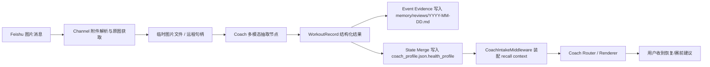

# Developer Specification (DEV_SPEC)

> 版本：3.0 — Coach 多模态运动记录与状态回忆

## 目录

- 项目概述
- 核心特点
- 技术选型
- 测试方案
- 系统架构与模块设计
- 项目排期
- 可扩展性与未来展望

***

## 1. 项目概述

### 1.1 项目定位

本阶段目标是在现有 `Badminton Coach Agent` 的文本教练链路之上，补齐“飞书图片入站 -> 运动截图结构化抽取 -> 身体档案更新 -> 后续对话主动回忆”的多模态闭环。

这不是单纯加一个识图 API，而是一次围绕 coach runtime 的架构升级。重点要解决四个问题：

- 飞书图片当前只记录元数据，无法进入可用的教练链路
- 运动截图中的数字、标签、图表关系复杂，纯 OCR 容易乱序，导致抽取不稳
- 单次运动明细属于事件证据，不能粗暴塞进 `coach_profile.json`
- agent 在下一次对话里还不会主动拿起“上一次身体状态”来回应

本阶段继续坚持 Phase 2 / Memory 2.2 的原则：

- `coach_profile.json` 仍是 canonical state
- `memory/reviews/YYYY-MM-DD.md` 仍承担事件证据沉淀
- 主路由保持文本优先，不让核心推理层直接承担图片理解复杂度

### 1.2 项目目标

本阶段有三层目标。

**产品目标**

- 用户可在飞书直接发送运动记录截图，获得恢复/训练建议
- 系统能把截图中的关键运动指标沉淀到身体档案体系
- 下一次相关对话里，agent 能主动提起最近一次高相关身体状态，而不是每次都像“第一次见面”

**工程目标**

- 打通飞书图片消息到 coach runtime 的可执行链路
- 用结构化多模态抽取替代纯 OCR 文本解析
- 明确“临时图片文件 / 事件证据 / 聚合状态”三层落盘边界
- 在 `CoachIntakeMiddleware` 中补齐状态回忆上下文装配
- 保持现有 `prematch` / `health` / `postmatch` 路由与 Memory 2.2 不冲突

**设计 / 面试目标**

- 能清楚说明为什么不用纯 OCR、为什么不把图片直接塞进主 prompt
- 能解释 event log 与 canonical profile 的职责分层
- 能展示“多模态降维 + 状态回忆 + file-first memory traceability”是一套完整工程设计，而不是零散能力堆叠

### 1.3 目标用户与使用场景

#### 1.3.1 目标用户

- 主用户：持续使用飞书和本地 workspace 的羽毛球训练者
- 次用户：有运动手表、健康 App、运动平台截图输入习惯的个人训练用户

#### 1.3.2 典型使用场景

| 场景 | 用户输入 | Agent 输出 |
| ---- | ---- | ---- |
| 运动截图恢复分析 | 飞书发送一次训练记录截图 | 提取时长、心率、训练负荷等关键指标，给出恢复建议 |
| 赛前状态承接 | “今晚打球注意什么？” | 主动引用最近一次高负荷 / 高疲劳记录，再给赛前计划 |
| 连续恢复追踪 | “今天还适合上强度吗？” + 截图 | 结合本次截图和上次状态，给保守强度建议 |
| 图文混合输入 | 截图 + “昨晚腿很沉” | 先抽取客观指标，再结合主观描述判断恢复 |

### 1.4 MVP 范围

#### 1.4.1 本期必须完成

- 飞书图片消息不再只生成占位文本，而是进入 coach 多模态处理链
- 引入专职多模态抽取层，将运动截图转换为强 Schema 的结构化结果
- 抽取结果先写事件证据，再 merge 到 `coach_profile.json.health_profile`
- `CoachIntakeMiddleware` 主动读取最近身体状态，形成可供路由与渲染使用的 recall context
- `health` 与 `prematch` 场景支持“主动提起上一次状态”的稳定行为
- 补齐结构化日志、测试用例与失败降级策略

#### 1.4.2 本期建议完成

- 为多模态抽取增加置信度字段与缺失槽位追问策略
- 为飞书图片入站增加临时文件缓存与清理策略
- 在评测集里加入至少一组图文混合样本

#### 1.4.3 本期不纳入 MVP

- 通用 OCR 引擎主链路
- 大规模历史图片回灌
- 多图片拼接理解
- 医疗级别诊断与建议
- 异步任务队列化的复杂重试系统
- 原始图片长期归档存储

### 1.5 当前已知约束

- 当前 `backend/app/channels/feishu.py` 对图片仅记录 `image_key` 和占位文本，未获取原图
- 当前 `CoachIntakeMiddleware` 只做文本、intent、persona 装配，不做状态回忆策略
- 当前 `health_image.py` 依赖文本输入做规则解析，更像 OCR 后处理，不是多模态入口
- 当前 `ViewImageMiddleware` 适合“已有本地图片 + 模型支持视觉”的通用场景，不适合作为飞书图片主入口
- 现有 Memory 2.2 已明确 `coach_profile.json` 不能承接海量原始事件明细

### 1.6 关键假设

- 假设 A1：本阶段采用 VLM 作为运动截图主抽取方式，不采用纯 OCR 作为主方案
- 假设 A2：原始图片默认只做短期临时落地，不进入长期 memory 存储
- 假设 A3：单次运动明细先写 `memory/reviews/YYYY-MM-DD.md`，profile 只保留聚合后的稳定状态
- 假设 A4：主动提起上一次状态必须由“intake 装配 + recall policy + renderer/prompt 约束”共同完成，不能只靠 prompt 祈祷模型记得
- 假设 A5：MVP 先接受同步抽取带来的延迟，若 P95 不可接受，再考虑异步化

### 1.7 成功标准

#### 1.7.1 功能成功标准

- 飞书图片消息可进入 coach 处理链，而不是只返回“请补文字描述”
- 对典型运动截图可稳定抽取核心字段：时长、心率类指标、训练负荷/压力、热量、恢复提示
- 每次成功抽取都能形成 event evidence，并驱动 `health_profile` 更新
- 下次相关对话中，agent 能在合适时机主动引用最近一次高相关身体状态

#### 1.7.2 质量成功标准

- 多模态抽取结构化成功率 >= 85%
- 高置信度错误写回率 <= 3%
- `prematch` / `health` 链路在带 recall 的情况下不明显增加误追问
- 不出现“单次截图明细直接膨胀 `coach_profile.json`”的设计回归
- 不出现“图片理解失败后仍强行给确定性建议”的安全回归

#### 1.7.3 可观测性成功标准

- structured logs 可统计图片消息量、抽取耗时、结构化成功率、降级率、写回率
- 可区分“VLM 抽取失败”“Schema 校验失败”“写回跳过”“仅事件不聚合”等结果
- 评测样本集覆盖图像输入、图文混合输入、状态回忆触发三类场景

***

## 2. 核心特点

### 2.1 多模态降维，而不是主路由直看图

本阶段的核心不是让主 coach router 直接处理图片，而是在进入主路由之前，先通过专职多模态抽取节点把图片“降维”为结构化 JSON。

原因：

- 主路由当前是文本优先设计，直接看图会污染上下文与推理职责
- 多模态抽取失败与教练推理失败应当被分开观测和降级
- 结构化 JSON 更适合后续写回、测试、回放和审计

### 2.2 三层落盘边界

本阶段明确三种不同的数据层：

1. **临时图片层**
   仅保存飞书图片的短期本地副本或可访问句柄，用于本次抽取，不作为长期 memory。
2. **事件证据层**
   将单次运动记录追加写入 `memory/reviews/YYYY-MM-DD.md`，保留可追溯的训练事实。
3. **聚合状态层**
   将本次事件提炼成有限的身体状态更新，merge 到 `coach_profile.json.health_profile`。

这三层分别服务于：

- 可处理性
- 可追溯性
- 可注入性

### 2.3 主动状态回忆

“下次对话里主动提起上一次内容”不是 prompt 小修能解决的问题，本质上是一个新的状态读取能力。

本阶段新增的不是长期记忆本身，而是 **state recall policy**：

- `CoachIntakeMiddleware` 读取最近一次高相关身体状态
- route 层根据当前意图判断是否要显式引用
- renderer / prompt 负责把引用表达为“回忆到的上下文”，而不是冒充实时事实

### 2.4 保守写回与可解释降级

任何截图抽取都必须先过：

- VLM 结构化输出
- Schema 校验
- 置信度 / 缺失字段判断
- 写回规则判断

若任一步不满足，系统应降级为：

- 只给保守建议
- 或只追问关键缺失项
- 或只写事件、不更新 profile
- 或延迟清理临时图片缓存

而不是为了“看起来聪明”去幻想数据。

### 2.5 对现有 Memory 2.2 的延续，而不是推翻

本阶段不重做 memory 架构，而是在 Memory 2.2 上增加一个 coach 多模态入口：

- `memory/reviews` 继续做 event evidence
- `coach_profile.json` 继续做 canonical state
- recall 继续遵守先低成本读 profile，再按需参考事件证据的原则

***

## 3. 技术选型

### 3.1 图片读取方式

- 主方案：VLM 结构化抽取
- 非主方案：OCR

选择理由：

- 运动截图里存在图表、卡片、标签和值之间的空间关系，纯 OCR 易丢失语义绑定
- VLM 更适合直接输出“字段 -> 值 -> 单位 -> 置信度”的结构化结果
- 结构化结果更容易进入代码校验和写回链路

取舍：

- 优点：抽取质量更高、对复杂版式更稳、便于强 Schema 输出
- 缺点：延迟和成本高于 OCR
- 决策：MVP 先以正确性优先，后续再看是否需要做图像压缩、缓存或异步化

### 3.2 多模态模型供应商

- 已确认方案：沿用现有模型配置体系，但为多模态抽取单独配置视觉模型，不直接复用当前文本主模型
- 推荐方案：主 coach 文本链路继续保持现有默认模型，多模态抽取单独使用 `gpt-4o` 级别的视觉模型

推荐理由：

- 当前项目默认文本环境仍以 `qwen3.5-plus` 为主，适合保持主对话链路稳定
- 仓库文档已经存在 `gpt-4o` 与 `supports_vision: true` 的配置范式，工程接入成本较低
- 多模态抽取更看重版式理解、数字绑定和结构化输出稳定性，这与主教练对话模型的诉求不同

tradeoff：

- 优点：图片抽取和文本推理解耦，后续可单独替换、评测和限流
- 缺点：模型配置会增加一个视觉模型项，成本管理稍复杂
- 决策：采用“同一套配置体系 + 单独视觉模型”的方案，而不是完全复用当前默认模型

### 3.3 原图获取策略

- 已确认方案：在 `Feishu Channel` 入站阶段直接下载原图并完成临时落地

理由：

- channel 离消息源最近，更适合统一处理 `image_key -> 本地可消费文件` 的转换
- 权限处理、失败重试、附件元数据补全都更集中
- runtime 只消费标准化输入，不关心飞书平台细节

### 3.4 数据落盘位置

- 原始图片：默认只做临时缓存，不做长期归档
- 单次运动明细：落 `memory/reviews/YYYY-MM-DD.md`
- 聚合状态：merge 到 `coach_profile.json.health_profile`

取舍：

- 不把原图长期保存，减少隐私与存储成本
- 不把单次明细全塞进 profile，避免 canonical state 膨胀
- 复用现有 `health_profile`，降低 schema 震荡

### 3.5 原图临时缓存与清理机制

- 已确认方案：原图临时缓存保留 30 天，到期自动删除

删除前校验规则：

- 先确认对应事件已经成功写入 `memory/reviews/YYYY-MM-DD.md`
- 再确认本次需要聚合的状态已经写入 `coach_profile.json`
- 若上述任一未完成，不执行删除，转为延后重试并记录日志

tradeoff：

- 优点：保留足够长的排障窗口，便于回看抽取失败样本
- 缺点：短期磁盘占用会增加，需要补清理任务和落盘校验
- 决策：优先保证可追溯与排障能力，再通过定时清理控制成本

### 3.6 主动回忆实现位置

- Intake 层：负责装配 recall context
- Domain route 层：负责判定何时引用 recall
- Response renderer / prompt：负责表达方式

不采用的方案：

- 只在 prompt 里写“请记得引用上一次状态”

原因：

- 这种做法不稳定、不可测、不可观测
- 无法控制哪些场景该提、哪些场景不该提

### 3.7 同步还是异步抽取

- 已确认方案：MVP 先做同步抽取

理由：

- 改动更小，链路更容易观察和联调
- 当前阶段目标是先验证真实截图抽取质量，而不是先堆异步基础设施
- 同步链路更利于定位“图片获取 / 抽取 / 写回 / recall”哪一层出了问题

***

## 4. 测试方案

### 4.1 设计理念：正确性优先于“假装智能”

本阶段测试重点不是模型能否“看起来懂图”，而是：

- 抽取结构是否稳定
- 写回边界是否安全
- recall 是否在正确场景触发
- 失败时是否能保守降级

### 4.2 测试分层策略

#### 4.2.1 单元测试

目标：

- 验证多模态抽取结果的 Schema 校验
- 验证 event log 与 profile merge 的边界
- 验证 recall policy 的触发条件

建议覆盖：

- 高负荷运动截图 -> 高风险 / 中风险判断
- 字段缺失 -> 触发追问或只给保守建议
- 只写 event、不写 profile 的分支
- `prematch` 引用最近疲劳状态的分支

#### 4.2.2 集成测试

目标：

- 验证飞书图片消息从入站到 coach route 的数据流转
- 验证多模态抽取与现有 `health` / `prematch` 链路兼容

建议覆盖：

- 飞书 image message 被转换为可消费输入，而不是占位文本
- 成功抽取后 `memory/reviews` 与 `coach_profile.json` 双写正确
- 下一次文本消息能命中 recall context

#### 4.2.3 端到端测试

目标：

- 验证真实用户路径：“发图 -> 收到恢复建议 -> 下次赛前被主动提醒”

核心场景：

- 场景 1：单张运动记录图 -> `health`
- 场景 2：图文混合输入 -> `health`
- 场景 3：前一天高负荷，次日赛前 -> `prematch` 主动 recall

### 4.3 测试数据策略

- 固定一组脱敏截图样本作为回归资产
- 为多模态抽取准备期望 JSON 样本
- 为 recall 行为准备 profile / review log 夹具

### 4.4 可观测性与评测

structured logs 建议新增：

- `image_ingest`
- `image_extract`
- `image_extract_failed`
- `coach_state_recall`
- `coach_profile_writeback`

离线评测建议新增维度：

- extraction_accuracy
- extraction_schema_validity
- writeback_safety
- recall_relevance
- conservative_fallback

***

## 5. 系统架构与模块设计

### 5.1 整体架构图

### 5.2 目录与修改范围

本阶段预计涉及以下现有区域：

- `backend/app/channels/feishu.py`
- `backend/packages/harness/deerflow/agents/middlewares/coach_intake_middleware.py`
- `backend/packages/harness/deerflow/domain/coach/`
- `backend/packages/harness/deerflow/domain/coach/profile_store.py`
- `backend/packages/harness/deerflow/domain/coach/response_renderer.py`
- `backend/tests/`

说明：

- 多模态抽取模块会放在现有 `coach domain` 范围内，具体文件名在实现阶段确认
- 若需要图片下载辅助模块，应优先放在 `channel` 侧邻近飞书接入逻辑的位置

### 5.3 模块职责

#### 5.3.1 Feishu 图片入站层

职责：

- 识别飞书图片消息
- 将仅有 `image_key` 的远程消息转换为可供 runtime 消费的图片输入
- 补充附件元数据、来源消息 ID、线程信息

设计约束：

- 不再只返回“请补文字描述”的固定占位
- 对图片获取失败要保留可解释错误信息

#### 5.3.2 Coach 多模态抽取层

职责：

- 接收图片与可选文字上下文
- 调用 VLM 输出强 Schema 的运动记录结构
- 返回字段值、单位、置信度、缺失字段、截图类型判断

建议的 Schema 范围：

- `record_type`
- `sport_type`
- `duration`
- `avg_heart_rate`
- `max_heart_rate`
- `training_load`
- `aerobic_stress`
- `calories`
- `recovery_hours`
- `confidence`
- `missing_fields`
- `raw_summary`

设计原则：

- 字段宁缺勿滥
- 无法确认时允许为空
- 必须明确“已知 / 推断 / 缺失”

#### 5.3.3 Event Evidence 写回层

职责：

- 将单次运动记录追加写入 `memory/reviews/YYYY-MM-DD.md`
- 保留 `thread_id`、消息来源、截图类型、结构化指标、抽取摘要

设计原则：

- event log 强调可追溯，不追求 prompt 轻量
- 可以保存更多明细和来源信息

#### 5.3.4 State Merge 层

职责：

- 从单次结构化运动记录推导可稳定保留的恢复状态
- merge 到 `coach_profile.json.health_profile`

建议聚合内容：

- `fatigue_level`
- `risk_flags`
- `recent_metrics`
- `last_updated_at`

本阶段不建议：

- 新增一个独立的 `workout_profile` 顶层结构

权衡：

- 复用 `health_profile` 变更更小，与“恢复建议”主场景更一致
- 如果未来出现长期训练负荷周期分析，再讨论独立 profile

#### 5.3.5 State Recall 装配层

职责：

- 在 `CoachIntakeMiddleware` 中读取最近一次高相关身体状态
- 产出可供 route / renderer 使用的 recall context

推荐 recall context 内容：

- `source`
- `recorded_at`
- `summary`
- `risk_level`
- `should_mention`
- `mention_reason`

触发建议：

- `health`：默认优先读取最近一次健康/运动记录
- `prematch`：当最近疲劳为 `medium/high`、最近 48 小时存在高负荷、或用户提到“今天/昨晚/恢复”时触发
- `postmatch`：本期仅可读，不强制主动提起

#### 5.3.6 Response / Prompt 表达层

职责：

- 把 recall context 渲染成一句自然、克制、可解释的开场上下文
- 明确使用“我记得上次记录里……”或“从你最近一次记录看……”这类回忆式表达

设计约束：

- 不把 recall 表达成绝对实时事实
- 不让 recall 抢占主回答主体

### 5.4 数据流说明

#### 5.4.1 图片恢复分析主链路

1. 飞书收到图片消息
2. Channel 层拿到原图或可消费句柄
3. 多模态抽取层输出结构化运动记录
4. 校验通过后，先写 `memory/reviews/YYYY-MM-DD.md`
5. 再按规则 merge `coach_profile.json.health_profile`
6. 生成恢复建议并返回用户

#### 5.4.2 下次对话主动回忆链路

1. 用户下一次发起文本消息
2. `CoachIntakeMiddleware` 读取 profile + 最近事件证据
3. recall policy 判断是否应主动引用
4. route 生成主体建议
5. renderer 在开头插入一条简短 recall line

### 5.5 错误处理与降级

需要明确以下降级分支：

- 原图获取失败：提示用户重发或补文字，不进入写回
- VLM 调用失败：不写回，只给保守建议或补问
- Schema 校验失败：不更新 profile，可选只记录失败日志
- 低置信度抽取：允许写 event evidence，但禁止更新 profile
- 临时缓存清理前校验失败：跳过删除并记录待重试
- recall 读取失败：主链路继续，不影响本次回答

### 5.6 配置驱动设计

建议将以下能力做成配置项：

- 是否启用多模态截图处理
- VLM 模型名 / 提供方
- 置信度阈值
- recall 时间窗口
- 是否允许“只写 event 不写 profile”
- 临时缓存保留天数

### 5.7 工作量评估

按当前架构和“先做最小可运行闭环”的原则，预计工作量为：

- MVP：6-9 个工程日
- 若加入异步抽取、失败重试、原图缓存治理：额外增加 3-5 个工程日

工作量拆分大致如下：

- 飞书图片原图获取：1-2 天
- 多模态抽取与 Schema 校验：2-3 天
- 双写与 recall policy：2 天
- 测试、日志与联调：1-2 天

***

## 6. 项目排期

### 阶段 A：图片入站与多模态抽取骨架

- 目标：打通飞书图片到结构化抽取结果的最小闭环
- 预计：2-3 个工程日

### 阶段 B：事件写回与 profile merge

- 目标：完成 event evidence 与 canonical state 的分层双写
- 预计：2 个工程日

### 阶段 C：状态回忆与回答表达

- 目标：让 `prematch` / `health` 稳定主动提起上一次相关状态
- 预计：1-2 个工程日

### 阶段 D：测试、观测与灰度

- 目标：补齐回归测试、structured logs、失败降级验证
- 预计：1-2 个工程日

### 风险点

- 飞书原图获取权限与 SDK 能力可能影响首阶段推进
- 多模态模型输出稳定性可能决定是否需要二次校验与更强约束
- 如果同步抽取延迟过高，可能需要提前转异步方案

***

## 7. 可扩展性与未来展望

### 7.1 从运动截图扩展到更广泛的身体状态输入

本阶段先处理运动记录截图，后续可扩展到：

- 睡眠截图
- HRV / 静息心率截图
- 恢复建议截图
- 周报类训练总结截图

### 7.2 从单次恢复建议扩展到周期化训练负荷管理

当 `memory/reviews` 中积累足够多的结构化运动事件后，可进一步支持：

- 近 7 天 / 28 天训练负荷趋势
- 连续高压日识别
- 自动恢复日建议

### 7.3 已确认决策

- 决策 1：沿用现有模型配置体系，但为多模态抽取单独配置视觉模型；推荐 `gpt-4o` 级别视觉模型
- 决策 2：飞书原图获取放在 channel 侧
- 决策 3：MVP 先做同步抽取
- 决策 4：原图临时缓存保留 30 天，删除前先校验 profile / review evidence 是否已落盘
